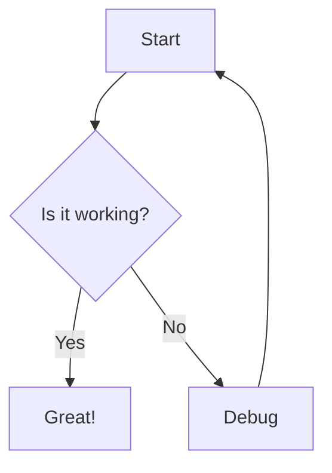

# MarkBrowse

A simple CLI tool to browse Markdown files via a web interface.

## Installation

```bash
go build
```

## Usage

```bash
markbrowse [--port <port>] <directory>
```

Example:
```bash
markbrowse ./
markbrowse --port 3000 ./docs
```

## Features

- Browse Markdown files in a directory structure
- Server-side rendered file list in sidebar
- Client-side Markdown rendering with marked.js
- Mermaid diagram support
- Automatic index.md/README.md detection for directories
- Single binary distribution with embedded assets

## Test

This is a test markdown file with various elements:

### Code Block

```go
func main() {
    fmt.Println("Hello, World!")
}
```

### List

- Item 1
- Item 2
  - Nested item
- Item 3

### Table

| Column 1 | Column 2 |
|----------|----------|
| Value 1  | Value 2  |
| Value 3  | Value 4  |

### Mermaid Diagram

